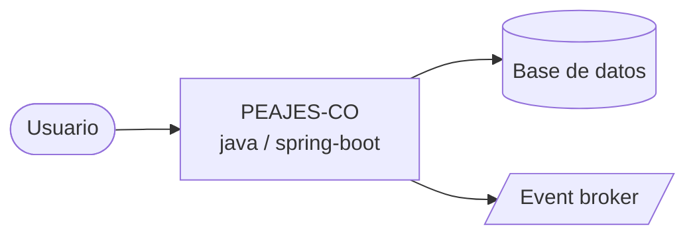

# Arquitectura

_Proyecto: **PEAJES-CO** · Stack: **Java 21 + Spring Boot 3.3 WebFlux / Java / Spring Boot / Java 21 / Maven / JUnit 5**_

## Diagrama C4 — Context

## Dominio
Operador electronico de peajes B2B2C - toll-collection, account-management, billing, reconciliation, incident-management

## Infraestructura
GCP Cloud Run + Cloud SQL Postgres 16 + Confluent Cloud Kafka

> Actualizar con: `agentic context --full` tras cambios en el TLM.
