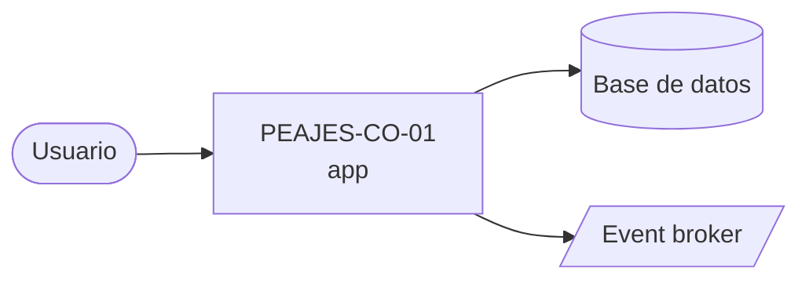

# Arquitectura

_Proyecto: **PEAJES-CO-01** · Stack: **Spring Boot 3.3.x + Spring WebFlux / Java / Java 21 / Maven 3.9.x / JUnit 5.10**_

## Diagrama C4 — Context

## Dominio
The business domain is 'Peajes Colombia' (Toll Collection in Colombia), focusing on electronic toll systems. The primary goal is to process high volumes of vehicle transactions (up to 1,500 transactions per second) with strict low-latency requirements (<150ms p95) for charge authorization, which directly impacts physical barrier operation and traffic flow. The system must integrate with various external dependencies, including RFID antennas, bank acquirers, the National Infrastructure Agency (ANI), payment gateways (PayU), and multiple concessionaires, all with potentially variable and unpredictable latencies. Key functionalities are divided into several bounded contexts: `toll-collection` (registering passes, validating tags, authorizing charges), `account-management` (managing accounts, balances, and tags), `billing` (generating electronic invoices compliant with DIAN regulations), `incident-management` (handling user disputes), and `reconciliation` (comparing system transactions with bank statements and concessionaire reports). The architecture aims to support a small development team in managing this complex domain while ensuring testability, scalability, and resilience against external dependency failures.

## Infraestructura
The infrastructure is primarily hosted on Google Cloud Platform, leveraging Cloud Run for scalable API services and Cloud SQL PostgreSQL for relational databases. Confluent Cloud provides a robust Kafka messaging backbone for inter-service communication and event streaming. External integrations utilize various protocols including HTTP REST and SFTP, all managed with Terraform for Infrastructure as Code.

> Actualizar con: `agentic context --full` tras cambios en el TLM.
